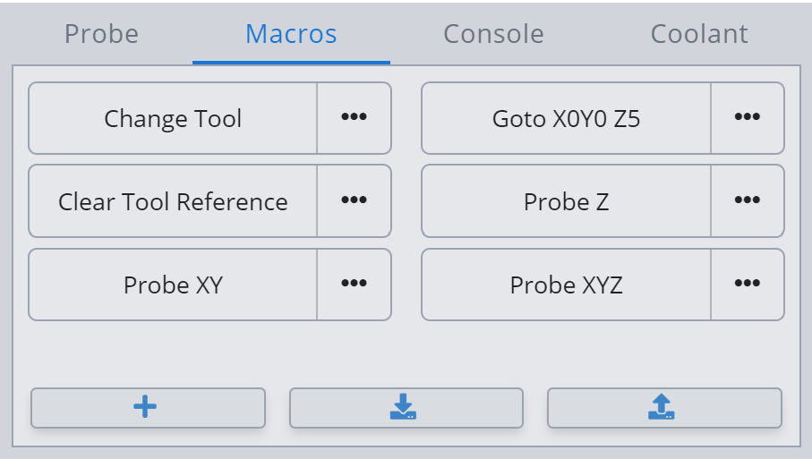

# Nomad 3 CNCjs/gSender Macros

Macros to use BitSetter and BitZero V2 in CNCjs/gSender with the Carbide 3D
Nomad 3. Use at your own risk. Test by cutting air first.

## Installation

Copy and paste the individual macros into CNCjs or gSender or import
[`nomad3-macros.json`](nomad3-macros.json) for all macros (gSender only).

## Important Notes

* With CNCjs, the "Cycle Start" button can be used to unlock the machine after
  the door is opened and closed. With gSender, `~` (cycle start) must be
  manually sent in the console to unlock the machine, as it currently doesn't
  offer a button for this (see [Sienci-Labs/gsender#441](https://github.com/Sienci-Labs/gsender/issues/441)).

* gSender ignores the M0 (program pause) code, used by some g-code
  post-processors for tool changes. Be sure to generate g-code with M6 tool
  changes instead of M0 pauses, if using gSender.
    * In Fusion 360, the "Carbide 3D (Grbl)" post-processor is fine.
    * In Carbide Create, select the "Carbide 3D Nomad Pro" post-processor, not
      "Basic G-Code" or "GRBL".

## BitSetter

* [Change Tool](bitsetter-change-tool.macro.nc) - Run once before job start, and on every tool change.
* [Clear Tool Reference](bitsetter-clear-tool-reference.macro.nc) - Run to clear tool reference.

This macro stores the tool reference height in machine coordinates, allowing
you to use it independently of work coordinate zeroing. When changing tools, it
calculates the offset in machine coordinates and applies the offset to the
current WCS Z.

## BitZero V2

* [Probe Z](bitzero-v2-probe-z.macro.nc) - Run with tool near top of probe top plate.
* [Probe XY](bitzero-v2-probe-xy.macro.nc) - Run with tool inside probing bore.
* [Probe XYZ](bitzero-v2-probe-xyz.macro.nc) - Run with tool inside probing bore.

#### Adjustments

Defaults should work fine, but variables for calibrating X, Y, and Z are available below:

* Adjust `PROBE_THICKNESS` in "Probe Z" macro for probe overall thickness.
* Adjust `PROBE_INSET_THICKNESS` in "Probe XYZ" macro for probe inset thickness (without black edge).
* Adjust `PROBE_X_OFFSET` / `PROBE_Y_OFFSET` in "Probe XY" and "Probe XYZ" macros for probe X and Y offset corrections.

## Miscellaneous

* [Go to X0Y0 Z5](goto-x0y0-z5.macro.nc)
